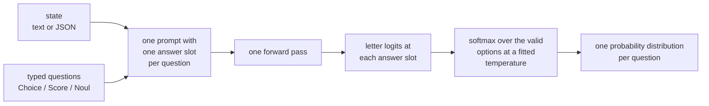

# decider: one-pass typed decisions with calibrated probabilities

[](https://github.com/Mapika/decider/actions/workflows/tests.yml)
[](https://huggingface.co/Mapika/decider-2b)
[](https://github.com/Mapika/decider/blob/main/LICENSE)

A language model that does not generate text. It reads a **state** and a set of **typed questions** and returns, from one
forward pass, a probability distribution for every question.

A typed decision is a question with a fixed answer set: **Choice** over 2 to 255 options, **Score** over 2 to 10 described
levels, or **Noul**, the probability of yes. There is no decoding, no parsing, and no output outside the options you defined.


*Recorded episodes; every move is one forward pass, and the bars are the served probabilities. Tetris: the harness shortlists
8 placements with a hand-tuned heuristic and states their consequences, and the model picks one (20 lines per game, against
0.6 for a random pick from the same 8). Pong uses an unreleased games-RL overlay. Sources, seeds and windows:
[docs/DEMOS.md](https://github.com/Mapika/decider/blob/main/docs/DEMOS.md).*

**Independence.** This is an independent project. It is not affiliated with or endorsed by TypeSafe AI. It is an open
reproduction of the "System One" model class (TypeSafe AI's *Jev*): a 2B model built on `Qwen/Qwen3.5-2B-Base`, a 4B model built on
`Qwen/Qwen3.5-4B-Base` and a 35B mixture-of-experts model built on `Qwen/Qwen3.5-35B-A3B-Base`. The training mixture is public datasets plus data labelled by a
local Qwen3.5-27B teacher (`teacher_data/`, `decider/data/mixture.py`). Nothing was distilled from Jev.

**Contents:** [What's new](#whats-new) · [Standing](#standing) · [Models](#models) · [Runs on](#runs-on) ·
[Quick start](#quick-start) · [Train your own](#train-your-own) · [How it works](#how-it-works) ·
[Limits](#limits-stated-plainly) · [Results](https://github.com/Mapika/decider/blob/main/docs/RESULTS.md)

## Team fork deployment (NVIDIA CUDA)

This fork is maintained at `omgwowai/decider`. In the autonomy scaffold it is pinned as the
`services/decider` Git submodule. Initialize submodules, then run from the scaffold root:

```sh
git submodule update --init --recursive
python services/decider/deploy.py
```

The launcher creates `services/decider/.venv-deploy`, installs **this checkout** and its serving
dependencies (not the public `decider-ai` release), downloads `Mapika/decider-0.8b` at immutable commit
`a0a01d6f8135298f400a8c856b355793012ae971`, checks real CUDA bfloat16 execution, and runs the official
`decider.serve:app` with one process on **127.0.0.1:8102**. Python 3.11 or 3.12 and a compatible NVIDIA
driver are required for managed installation. It installs PyTorch 2.8 CUDA 12.8 wheels; Windows also
installs `triton-windows` 3.4. FLA 0.5.2 avoids pulling the Linux-only Triton package on Windows.
An installation/import/CUDA/warmup error aborts instead of silently using CPU. Initial graph warmup
can take time and GPU memory; the launch banner alone is not evidence of readiness.

To use an **existing compatible GPU Python without changing its packages**, explicitly opt out of installation:

```sh
python services/decider/deploy.py --python /path/to/gpu/python --skip-install --local-model /path/to/decider-0.8b --port 8102
```

Windows accepts paths such as `--python D:/envs/gpu/Scripts/python.exe`. `--local-model` requires a
complete checkpoint with configuration, tokenizer and safetensors files and does not download weights.
Without it, weights use the dedicated ignored `.cache/huggingface` directory. Override `--model`
only together with an immutable 40-character `--revision`; `main` and tags are rejected.
Other options: `--venv`, `--cache-dir`, `--host`, `--device cuda:0`, `--max-batch` (8),
`--batch-wait-ms` (0), `--token-budget` (8192), and `--max-pending` (64). No 8100/8101 service is
stopped or modified. Inherited `DECIDER_*` experiment settings are cleared for the launched service;
the current checkout is selected explicitly, and model loading after download is offline.

```sh
curl http://127.0.0.1:8102/health
```

Require both `ok: true` and `cuda_ready: true`, with a CUDA `device`. Model creation, schema-cache
initialization, graph warmup, final synchronization and inference all run on the same GPU owner thread.
Failed or incomplete batches return errors, not partial success. Pending requests are bounded **before
tokenization**, in addition to the existing row limit; a disconnected client does not release capacity
while its inference is still running. Overload returns HTTP 503.

The scaffold uses `POST /v1/systemone` with the official envelope:

```json
{"state":"{\"need\":\"food\"}","questions":{"selection":{"type":"choice","instructions":"Choose the next action","criteria":{"eat":"Eat available food","rest":"Rest on the sofa"}}},"independent":true,"layout":"state_first"}
```

`state` is a compact JSON **string**, not a flattened feature summary. Criteria retain insertion order.
Responses remain `{model, answers, usage}`. This deployment enables `DECIDER_REJECT_TRUNCATION=1`:
oversized states/rows/requests fail with HTTP 413 rather than silently losing state. The token budget
limits total request scoring tokens and padded microbatches. Shared-prefix and schema-cache opt-ins
are disabled for this state-first deployment; the upstream native features and other device paths
remain available when starting `decider.serve` directly with its documented environment options.

Library users may opt into `Decider(..., fixed_length=192)` (CUDA graphs required), or
`Engine(..., fixed_length=192)`. Complete prepared rows are padded to exactly that length; oversized
rows raise `ValueError` before inference, including shared-prefix calls. The default remains bucketed.
The HTTP server retains the upstream `EngineV2` pre-captured bucket grid rather than replacing it with
the older single-shape service. Existing library prompt context limits still apply before row scoring.

Security boundary: the API has no authentication; keep loopback binding. Explicit non-loopback
`--host` requires your own authenticated proxy/firewall and request-body limits. Only load trusted
model checkpoints. No game mutations are performed by this service. Do not commit environments,
model caches, weights, logs or experiment data.

Focused regression tests (from this submodule; no model download is needed for these contracts):

```sh
python -m pytest tests/test_deploy.py tests/test_engine_fixed_length.py tests/test_serve_http.py tests/test_serve_prepare.py tests/test_serve_device.py
```

## What's new

* **2026-09-22 — decider-4b v1.** Qwen3.5-4B-Base, one pass over mixture v2 (the public mixture plus 26 further public
  datasets and ten programmatic families), AdamW on bf16 parameters, no RL stage. Above decider-2b v10 on 87 of 95 regression
  tasks (0.834 / 0.788 against 0.805 / 0.755), JevBench hard tier 0.541, Bespoke's suite 0.757; level with the 2B on TypeSafe
  and OpenJev and 17 points below it on the held-out browser tasks. 8.4 GB bf16.
* **2026-09-22 — 1.1.0: the HTTP server captures its CUDA graphs at start-up.** On the default path no request compiles or
  captures a graph (the opt-in schema cache still captures one graph set per schema the first time it is used); request-size
  and queue limits; `DECIDER_COMPILE` and `DECIDER_FP8` default off. Details in docs/CHANGELOG.md.
* **2026-09-22 — 1.0.2 fixes wrong answers from the cached shared-state path** on Blackwell (a cuDNN attention backend fault; the
  engine now turns that backend off). Upgrade if you serve long shared-state requests; details in docs/CHANGELOG.md.
* **2026-09-22 — On PyPI as `decider-ai`** (the import name stays `decider`).
* **2026-09-22 — Apple Silicon.** MPS acceleration for the dense models (0.8B, 2B, 2B vision), merged from pull request #2 by
  **@simply-sunny**. See [Runs on](#runs-on).
* **2026-09-20 — decider-35b-a3b v1**, and its NVFP4 build. The supervised recipe on Qwen3.5-35B-A3B-Base, routed experts
  frozen, Muon on the block matrices; above decider-2b v10 on 93 of 95 regression tasks; no RL stage.
* **2026-09-19 — decider-2b v10.** The v8 weights plus 384 steps of calibration-aware RL on live browser tasks and exact
  games: sampled browser play 83% to 93%, belief 0.47 to 0.22 nats above the exact laws, everything else unchanged.

Earlier versions, v1 to v9, are in [docs/CHANGELOG.md](https://github.com/Mapika/decider/blob/main/docs/CHANGELOG.md), with the per-stage measurements in
[docs/HISTORY.md](https://github.com/Mapika/decider/blob/main/docs/HISTORY.md).

## Standing

Two third-party leaderboards rank this model class. Both were read on the dates given; we did not run them.

**JevBench**, read 2026-09-21 ([Benchmark Heaven](https://benchmarkheaven.com/jev-models), harness at
[fstandhartinger/jevbench](https://github.com/fstandhartinger/jevbench)). 36 entries; the total score combines four axes, and
speed and cost are measured from the operator's server.

| system | score | intelligence | calibration | speed | cost |
|---|---|---|---|---|---|
| Jev 1.13.0 (TypeSafe AI, #1) | 75.4 | 90.4 | 82.7 | 83.3 | 52.0 |
| SemIf (Qwen3.5-4B, #2) | 74.7 | 85.9 | 72.6 | 83.7 | 59.5 |
| **decider-35b-a3b** (#10 of 36) | 68.9 | 86.3 | 71.5 | 80.8 | 45.3 |
| **decider-2b** (#21 of 36) | 64.6 | 73.8 | 46.6 | 83.2 | 61.0 |

Our 35B is pulled down by cost (45.3, priced as a 35B), the 2B by calibration (46.6).

**Decision Index**, edition v0.1 dated 2026-09-22
([leaderboard](https://multimodalart-jev-decision-index.static.hf.space), kit at
[apolinario/decision-index](https://github.com/apolinario/decision-index)). 32 entries, 132,422 requests, 37 benchmarks,
scored on a 19-benchmark panel.

| system | score | rank |
|---|---|---|
| Jev | 59.5 | 1 |
| jevfire (zero-training wrapper on a stock 27B-class model) | 55.7 | 2 |
| joshua-diffusion (zero-training wrapper on a stock 27B-class model) | 55.6 | 3 |
| **decider-35b-a3b (NVFP4)** | 54.3 | 4 |
| **decider-2b** | 44.0 | 14 |

decider-35b-a3b is fourth of 32 and the highest-scoring trained model on this edition; the two entries above it are
zero-training wrappers.

### Where Jev leads

The gap to Jev is the knowledge area. Per-area scores on the Decision Index panel, decider-35b-a3b against Jev:

| area | decider-35b-a3b | Jev |
|---|---|---|
| knowledge (GPQA, GSM8K, CRUXEval, MMLU) | 0.51 | 0.69 |
| language | 0.61 | 0.62 |
| retrieval | 0.34 | 0.37 |
| tools | 0.72 | 0.73 |
| arts | 0.53 | 0.56 |

Language, retrieval, tools and arts are within 0.03. Knowledge is 0.18 behind, on GPQA, GSM8K, CRUXEval and MMLU. The same
weakness shows on JevBench's 111 public hard items, which are long policy texts, multi-hop and temporal-numeric reasoning:
decider-35b-a3b 0.676 and decider-2b 0.459 against Jev's 0.730 (our runner and the harness's own per-task file, same items). The other axis we lose there is calibration on hard items; see
[Limits](#limits-stated-plainly).

## Models

Held-out means no example of that dataset was trained on. The regression set has 28 held-out tasks, the 94-task set 24; the
two are not comparable to each other, and the NVFP4 row is measured against the bf16 build rather than on a held-out set.
[docs/RESULTS.md](https://github.com/Mapika/decider/blob/main/docs/RESULTS.md) has all of them in full.

| model | base | parameters | context | held-out accuracy | weights |
|---|---|---|---|---|---|
| decider-2b **v10** | Qwen3.5-2B-Base | 1.9B | 32k tokens | 0.755 (regression set) | [Mapika/decider-2b](https://huggingface.co/Mapika/decider-2b) |
| decider-4b **v1** | Qwen3.5-4B-Base | 4.2B | 32k tokens | 0.788 (regression set) | [Mapika/decider-4b](https://huggingface.co/Mapika/decider-4b) |
| decider-35b-a3b **v1** | Qwen3.5-35B-A3B-Base | 34.7B total, 3B active | 32k tokens | 0.810 (regression set) | [Mapika/decider-35b-a3b](https://huggingface.co/Mapika/decider-35b-a3b) |
| decider-35b-a3b-nvfp4 | the 35B in NVFP4, 19.6 GB | 34.7B total, 3B active | 32k tokens | 1.0 to 1.5 points under bf16 in vLLM | [Mapika/decider-35b-a3b-nvfp4](https://huggingface.co/Mapika/decider-35b-a3b-nvfp4) |
| decider-0.8b | Qwen3.5-0.8B-Base | 0.8B | 32k tokens | 0.71 (94-task set) | [Mapika/decider-0.8b](https://huggingface.co/Mapika/decider-0.8b) |
| decider-2b-vision | Qwen3.5-2B vision-language, v5 text weights | 1.9B | 32k tokens | Visual7W 0.89 (see MODEL_CARD_VISION.md) | [Mapika/decider-2b-vision](https://huggingface.co/Mapika/decider-2b-vision) |

The v8 weights stay available under the Hub tag `v8`. decider-4b is the first model trained on mixture v2 (the public mixture
plus 26 further public decision datasets and ten programmatic families with verifiable gold); the mixture-v2 builders are not
yet in this package, `scripts/train.sh full` reproduces the public 60% of its data. decider-2b-vision has a
[browser demo](https://huggingface.co/spaces/hugging-apps/decider-2b-vision-demo), a Space built by the Hugging Face team.

## Runs on

* **CUDA.** bf16, `torch.compile`, shape-bucketed CUDA graphs, optional FP8 (e4m3) linears. The 2B needs about 4 GB, the 4B 8.4 GB, the 35B
  65 GB in bf16 or 19.6 GB in NVFP4.
* **Apple Silicon, MPS.** Merged 2026-09-22 from pull request #2 by **@simply-sunny**. On an M1 Pro in float16, across the
  three 2B smoke-test workloads, the median request is 133 ms with the patch and 171 ms without it; on the held-out MASSIVE
  Scenario set (1,500 examples, temperature 1.30) the MPS path scores accuracy 0.7553 and ECE 0.0438 against the published
  bf16 row's 0.756 and 0.041. Conditions: `docs/benchmarks/mps-full-model.md`, `docs/benchmarks/mps-heldout.md`.
* **CPU.** The library and the HTTP server run on CPU in bfloat16, eager; the unit tests run without a GPU: `python -m pytest tests`.

## Quick start

```bash
pip install decider-ai                                     # or: git clone https://github.com/Mapika/decider && pip install -e ".[serve]"
```

On Apple Silicon, `pip install "decider-ai[metal]"` adds the optional MLX/Metal kernel. Without it, MPS inference uses the PyTorch implementation.

```python
from decider.infer import Decider
d = Decider("Mapika/decider-2b")                             # one CUDA GPU, bf16, about 4 GB; downloads the weights on first use
d.system_one(
    {"ticket": {"messages": [{"from": "customer", "text": "I was charged twice for order A-104. Please refund the duplicate."}]},
     "refund_policy": "Duplicate charges are eligible for a refund."},
    {"department": {"type": "choice", "instructions": "Which team should handle this?",
                    "criteria": {"returns": "Exchanges, refunds, wrong or damaged items", "billing": {"what": "Charges, invoices", "not_for": "delivery"}, "other": None}},
     "refund_requested": {"type": "noul", "instructions": "Does `ticket.messages[0].text` request a refund?"},
     "frustration": {"type": "score", "instructions": "How frustrated is the customer?", "criteria": ["calm", "frustrated", "very frustrated"]}})
# {"answers": {"department": {"choice": "billing", "confidence": 0.56, "certainty": 0.37, "probabilities": {"returns": 0.44, "billing": 0.56, "other": 0.00}},
#              "refund_requested": {"noul": 0.99},
#              "frustration": {"score": 0.76, "probabilities": {"0": 0.34, "1": 0.55, "2": 0.10}, "level_fit": {"0": 0.34, "1": 0.55, "2": 0.10}, "fit_mass": 0.99}}}
#                                                             (v10 weights; "returns" also mentions refunds, so the mass is split)

d.decide("My card was charged twice.", [{"question": "Which team?", "options": ["billing", "technical", "sales"]}])
# [{"choice": "billing", "confidence": 0.77, "probs": {"billing": 0.77, "technical": 0.19, "sales": 0.04}}]      the plain form
```

`examples/` has three complete programs: confidence-gated routing, composite scoring, and a hierarchical beam over Choice
probabilities.

### HTTP server

```bash
scripts/serve.sh Mapika/decider-2b 8000
```

`POST /v1/systemone` is TypeSafe's wire format, so their SDKs work unchanged with `TYPESAFE_BASE_URL=http://localhost:8000`;
`POST /decide` is the plain form. The server picks its device as `Decider` does (CUDA, else MPS, else CPU; `DECIDER_DEVICE`
overrides it). On CUDA it captures a CUDA graph for every (batch, length) shape at start-up, so on the default path no
request compiles or captures a graph; on MPS and CPU every request runs eager; requests over its size limits get HTTP 413 and an overloaded server
answers 503 (limits, defaults and measurements in `docs/SERVING.md`). The schema cache (a schema seen twice gets a cached prefix
and its own graphs, captured the first time that schema is used) is on only for a model whose `decider_config.json` sets
`schema_first`, or with `DECIDER_SCHEMA_CACHE=1`.

## Train your own

```bash
uv venv --python 3.12 .venv312 && uv pip install -p .venv312/bin/python -e ".[serve,train]"
scripts/train.sh full                       # datasets -> data/tasks.pkl -> data/mixture_full.pkl -> one epoch from Qwen3.5-2B-Base -> scripts/evaluate.sh
scripts/train.sh delta runs/some/model      # or: continue an existing decider checkpoint on the new formats + a replay sample
```

The full recipe and the data builders are in this repository: `decider/data/` downloads and converts about 95 public datasets
and assembles the mixture (`decider/data/mixture.py` lists every component with its size), `decider/train.py` is the
fine-tune, `scripts/evaluate.sh` scores it. One epoch is 1.47M examples and 455M tokens, 5.3 h on a GH200 plus 45 min of
evaluation, and it reproduces the released supervised weights: it matches v9 on the 94-task set (in-task 0.809 against 0.812,
held-out 0.739 against 0.741) and every probe family within noise, with a fitted temperature of 1.03 instead of 1.36.

The RL stage that turns v8 into v10 ([docs/RL.md](https://github.com/Mapika/decider/blob/main/docs/RL.md)) needs a live Chrome with MiniWoB++, the exact game environments
and the training loop of a separate research repository; it is not in this package yet.

## How it works



`decider/prompt.py` renders a request as text with one answer slot per question. `decider/model.py` reads the hidden state at
each slot, projects it onto one label token per option (A-J, then K-Z and two-letter tokens up to 255) and softmaxes over the
valid ones. Letters are never generated, so all slots come out of one pass. The temperature is fitted once on in-task data and
checked on held-out tasks. Every question can also be scored in its own row, and then adding, removing or reordering questions
cannot change another answer; every Score level is judged alone, without its number or its neighbours.

Two prompt layouts are trained, 50/50. **State-first** (`Context ... Question ... Options ... Answer: (`) is the default.
**Schema-first** puts the question and option blocks before the state, so they form a prefix that does not depend on the
state: `decider/schema_engine.py` runs that prefix once per schema, keeps its cache read-only, and a request then runs only
`Context: <state>` plus the slots, as a CUDA graph per (batch, length) bucket. Schema-first trades accuracy for speed, so the
cache is opt-in; the cost is measured in [docs/RESULTS.md](https://github.com/Mapika/decider/blob/main/docs/RESULTS.md).

### Calibration


Calibration is what the v10 RL objective trains directly. For every action in a game with a known probability law the model
is asked what will happen next, and its answer is scored against the exact law with a log score: v10 is 0.22 nats above the
law where v8 was 0.47. In the browser it predicts the outcome of its own click at a log score of −0.03 against −0.35.

## Limits, stated plainly

* **One pass cannot do multi-step arithmetic.** There is no chain of thought and no intermediate state, so GSM8K-type items,
  temporal arithmetic and multi-hop chains are out of reach. Split such a judgment into several questions.
* **Calibration on hard items is the weak axis.** decider-2b's top-label ECE on JevBench's hard items is 0.30: it is
  confident where it is wrong there, which is what pulls its calibration axis to 46.6. The 35B's hard-tier ECE is 0.15.
* **Knowledge-heavy multiple choice.** decider-2b improves little over its base model on MMLU and MedQA. decider-4b closes
  part of it (MMLU +11, MedQA +17 points over the 2B, hard tier 0.54) and decider-35b-a3b more (MMLU +19 points, hard tier 0.68)
  at 3 to 4 times the cost per decision; neither has the RL stage.
* **Optimizer setting on the 35B.** decider-35b-a3b was trained with FP32 master weights (Muon on the block matrices, AdamW
  elsewhere). In later controlled runs that setting moved small models further from their base than the same schedule
  without a master copy, and cost accuracy on knowledge tasks. The 2B and the 4B were trained without a master copy and are not affected.
  A 35B retrain without it is planned.
* **English only.** Calibration is measured on public datasets and teacher-labelled probes, not on your traffic.
* **The schema cache costs accuracy.** Use it for fixed classification-style schemas with short states; see docs/RESULTS.md.
* **Generic options need to look like buckets.** v10 continues the v8 weights, so the v9 terse-bucket result (generic 0.86)
  does not apply to it; v8's 0.59 does. A plain `support` next to `other` sends an in-scope complaint to `other`.
* **Rules written into the question are not followed at this size.** On the form-filling probe a one-sentence question scores
  0.67 and a paragraph of rules 0.24. A fixed convention has to be in the training data, not in the question.
* **Picking a record out of a long JSON array by position is the least accurate input shape** (0.51 with 64 records against
  0.70 with one). Address records by key, or let `render_state` write the index into the array (0.62).
* **Known regressions.** TREC-fine with all 50 labels fell from 0.76 (v6) to 0.72 (v8). Held-out Freeway play fell to 0 and
  did not come back when the game data was replayed. OpenJev is 0.8 points lower on v10 than on v8.
* **Teacher bias.** The custom-question data is labelled by a 27B teacher that shares some of the biases it is meant to fix;
  it agreed with only 72% of its own generic-option labels. `decider/data/mixture.py` shows how they are filtered.
* **Browser results are narrow.** They are on the 22 click-only MiniWoB++ tasks: small synthetic pages, elements listed as
  text. Typing, scrolling and real websites were not tested.
* **The vision variant** (`decider/vision`) is still on v5 text weights and is retraining.
* **Reproduction is not byte-identical.** The released weights were produced by staged continuation runs; `scripts/train.sh
  full` reproduces the supervised stages in one run, and the 16-to-60-case hand-written probes move by a few cases either
  way.

## Repository layout

```
decider/prompt.py        the two prompt layouts, label table, answer slots
decider/model.py         DecisionModel: backbone -> slot hidden states -> option logits
decider/systemone.py     Choice / Score / Noul with criteria -> prompt rows; typed answers; isolated levels
decider/infer.py         Decider: system_one(), schema() (compiled, cached question sets), decide()
decider/engine.py        CUDA graphs, torch.compile, shared-prefix scoring;  fp8.py, schema_engine.py, mps_ops.py
decider/serve.py         HTTP server: /v1/systemone, /decide, continuous batching
decider/data/            ~95 public datasets, input-shape augmentations, the mixture, the 27B teacher data
decider/train.py         cross-entropy fine-tune;  evaluate.py  accuracy / NLL / Brier / ECE / AURC per task
decider/probes/          hand-written batteries, question independence, isolated levels
decider/bench/           engine, schema-cache and MPS benchmarks, HTTP load test, Bespoke's public suite
decider/games/           ten text games + Super Mario Bros behind the same interface, imitation and PPO
decider/vision/          the vision-language variant (decisions from pixels)
moe/                     frozen-expert Muon training, evaluation and NVFP4 quantization for decider-35b-a3b
scripts/  examples/  tests/  teacher_data/  media/
docs/                    RESULTS.md (every measurement), CHANGELOG.md, HISTORY.md, RL.md, benchmarks/ (MPS)
```

## Citation

```bibtex
@software{marosi2026decider,
  author = {Marosi, Mark},
  title  = {decider: one-pass typed decisions with calibrated probabilities},
  year   = {2026},
  url    = {https://github.com/Mapika/decider}
}
```

## License

Apache 2.0. See [LICENSE](https://github.com/Mapika/decider/blob/main/LICENSE).
